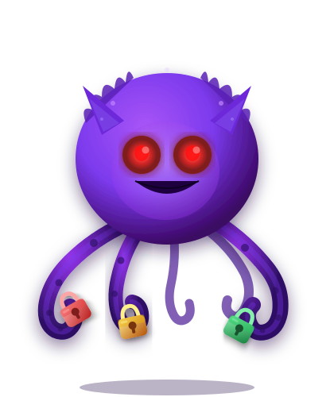

# multisigmonitor

<p align="center">
  
</p>

<p align="center">
  
  
  
  <a href="https://github.com/W3OSC/multisigmonitor/issues"></a>
  <a href="https://github.com/W3OSC/multisigmonitor/blob/main/LICENSE"></a>
  <a href="https://t.me/+yhmMnY2DyNBmNDlh"></a>
</p>

<p align="center">
  <a href="https://github.com/W3OSC/multisigmonitor/issues/new?template=bug_report.md" title="Report a bug">Report a bug</a>
  | <a href="https://github.com/W3OSC/multisigmonitor/issues/new?template=feature_request.md" title="Feature request">Feature request</a>
  | <a href="https://github.com/W3OSC/multisigmonitor/discussions" title="Discussions">Discussions</a>
  | <a href="CONTRIBUTING.md" title="Contributing guide">Contributing</a>
  | <a href="https://t.me/+yhmMnY2DyNBmNDlh" title="W3OS Telegram">Telegram</a>
</p>

multisigmonitor (MSM) is an analysis and real-time monitoring tool for Safe{wallet} multisig wallets, that identifies management transactions by examining the decoded tx data looking for any tx that changes who controls your Safe or how it operates.

Monitoring management transactions means you can detect and respond to:
- Governance attacks (adding malicious owners via `addOwnerWithThreshold`, `removeOwner`, `swapOwner`)
- Unauthorized changes to the Safe's configuration (`setFallbackHandler`, `changeMasterCopy`, `setup`, `setGuard`)
- Threshold decreases that weaken security (`changeThreshold`)
- Safe module additions that may introduce vulnerabilities (`enableModule`, `disableModule`)
- Maintain auditable records of all governance changes for compliance or transparency requirements 


## Why

Governance attacks happen at the config layer. by the time you see a malicious transfer, it's too late. monitoring owner additions, threshold changes, and module enables gives you lead time to respond.

## Setup

Until the monitoring system is fully built, you can run the analysis engine locally to assess the risk of your Safe's current configuration:

```
git clone https://github.com/W3OSC/multisigmonitor
make setup
make start
```

You then should be able to access the local dashboard at http://localhost:7110


## Contributors

<br>
<table>
<tr>
    <td align="center">
        <a href="https://github.com/fredrik0x">
            
            <br />
            <sub><b>fredrik0x</b></sub>
        </a>
    </td>
    <td align="center">
        <a href="https://github.com/forefy">
            
            <br />
            <sub><b>forefy</b></sub>
        </a>
    </td>
</tr>
</table>
<br>

> **📢 Contributing to W3OS**
>
> W3OS is an open standard developed collaboratively by the Web3 security community. Contributions by anyone are welcome.
>
> - 📖 **Read the [Contributing Guide](CONTRIBUTING.md)** for detailed information on how to propose changes, add new sections, and improve existing content
> - 💬 **Join the [Telegram Discussion Group](https://t.me/+yhmMnY2DyNBmNDlh)** to participate in ongoing collaboration and connect with other contributors
>
> _Help build the comprehensive operational security standard for Web3 organizations._
