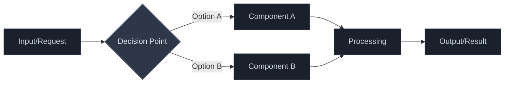

# {short title, representative of solved problem and found solution}

## Context and Problem Statement

{Describe the context and problem statement, e.g., in free form using two to three sentences or in the form of an illustrative story. You may want to articulate the problem in form of a question and add links to collaboration boards or issue management systems.}

## Considered Options

- {title of option 1}
- {title of option 2}
- … <!-- numbers of options can vary -->

## Decision Outcome

Chosen option: "{title of option 1}", because {justification. e.g., only option, which meets k.o. criterion decision driver | which resolves force {force} | … | comes out best (see below)}.

### Decision Outcome Visualization
<!-- Mermaid diagram of adr proposed result architecture, not the decision making itself, ensure to follow proper mermaid syntax, diagram, direction is top-to-bottom -->
