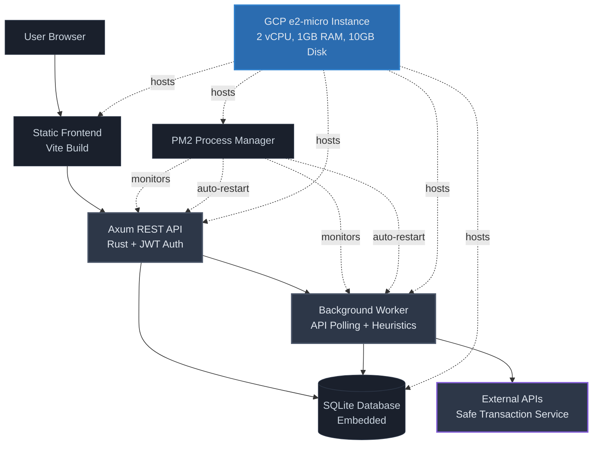

# Self-Hosted Deployment Stack for Cost-Effective Multisig Monitoring

## Context and Problem Statement

The multisig monitor application requires a deployment strategy that minimizes costs while providing reliable, predictable performance with full control over infrastructure. The application consists of a frontend (Vite/React), background monitoring worker (API polling and heuristic analysis), REST API backend, database for configurations and alerts, and authentication system. Previous consideration of serverless edge functions proved unreliable due to cold starts, execution limits, and unpredictable behavior. How can we deploy this application with predictable performance at minimal cost while maintaining full control?

## Considered Options

- Vercel, Supabase Edge Functions (free tiers)
- Self-hosted single instance with Rust backend and SQLite
- Container orchestration (Kubernetes, Docker Swarm)

## Decision Outcome

Chosen option: "Self-hosted single instance with Rust backend and SQLite", because it provides full control over the entire stack, eliminates cold start issues, offers predictable performance at a fixed cost, and matches the application's workload requirements without the complexity of orchestration or the unpredictability of serverless architectures.

### Decision Outcome Visualization

### Consequences

**Positive:**

- Full control over entire stack eliminates vendor lock-in
- Predictable performance with no cold starts
- Simple deployment model with single Rust binary
- Native Rust performance and memory safety guarantees
- SQLite simplicity with no separate database process
- PM2 provides reliability, monitoring, and zero-downtime deployments
- Fixed $8/month cost with GCP e2-micro instance

**Negative:**

- Manual infrastructure management required
- Single point of failure without auto-scaling
- Manual backup strategy must be implemented

**Tradeoffs:**

- Trading serverless convenience for control and reliability
- Single instance sufficient for current monitoring workload
- Instance can be upgraded if needed
- Rust compilation time traded for superior runtime performance
