# Services Layer Deep Dive

> The intelligence layer that understands threats and keeps your assets secure

```mermaid
%%{init: {'theme':'dark'}}%%
flowchart TB
    Input([📥 Transaction Data]) --> Entry

    subgraph SecurityAnalysis["🛡️ Security Analysis Service"]
        Entry[Parse Transaction]
        Entry --> Basic[Extract Core Data]
        
        Basic --> Info[📋 Basic Info<br/>• To Address<br/>• Value<br/>• Operation Type<br/>• Data Hash]
        
        Info --> Decode{Data<br/>Decoded?}
    end

    Decode -->|yes| Advanced
    Decode -->|no| Simple[Basic Analysis Only]

    subgraph Heuristics["🔍 Risk Detection Heuristics"]
        Advanced[Run Advanced Checks]
        
        Advanced --> H1[💰 Value Threshold Check<br/>ETH > 10 = HIGH<br/>ETH > 1 = MEDIUM]
        Advanced --> H2[⚠️ Critical Method Detection<br/>transferOwnership<br/>addOwner/removeOwner<br/>changeThreshold<br/>enableModule/disableModule]
        Advanced --> H3[🎫 Token Approval Analysis<br/>approve/increaseAllowance<br/>setApprovalForAll<br/>Unlimited approvals]
        Advanced --> H4[🔗 Delegate Call Check<br/>DELEGATECALL operations<br/>Proxy upgrades]
        Advanced --> H5[📊 Parameter Analysis<br/>Address patterns<br/>Value patterns<br/>Array lengths]
        
        H1 & H2 & H3 & H4 & H5 --> Aggregate
    end

    Simple --> Score
    Aggregate[Combine Risk Signals] --> Score

    subgraph RiskScoring["🎯 Risk Level Assignment"]
        Score{Calculate<br/>Risk Score}
        
        Score -->|critical methods| High1[🔴 HIGH RISK]
        Score -->|large value| High2[🔴 HIGH RISK]
        Score -->|dangerous approval| High3[🔴 HIGH RISK]
        Score -->|delegate call| High4[🔴 HIGH RISK]
        
        Score -->|moderate value| Med1[🟡 MEDIUM RISK]
        Score -->|standard approval| Med2[🟡 MEDIUM RISK]
        Score -->|suspicious pattern| Med3[🟡 MEDIUM RISK]
        
        Score -->|normal operation| Low[🟢 LOW RISK]
        
        High1 & High2 & High3 & High4 --> HighOut
        Med1 & Med2 & Med3 --> MedOut
    end

    HighOut[HIGH] --> Output
    MedOut[MEDIUM] --> Output
    Low --> Output

    subgraph AnalysisOutput["📊 Analysis Result"]
        Output[Generate Report]
        Output --> Details[📝 Details<br/>• Risk Level<br/>• Method Called<br/>• Value Involved<br/>• Target Address<br/>• Decoded Parameters<br/>• Risk Factors Found]
        
        Details --> Store[(💾 Store in Database<br/>security_analyses table)]
        Store --> Return([✅ Return to Worker])
    end

    style Input fill:#6366f1,stroke:#818cf8,color:#fff
    style High1 fill:#ef4444,stroke:#f87171,color:#fff
    style High2 fill:#ef4444,stroke:#f87171,color:#fff
    style High3 fill:#ef4444,stroke:#f87171,color:#fff
    style High4 fill:#ef4444,stroke:#f87171,color:#fff
    style Med1 fill:#f59e0b,stroke:#fbbf24,color:#fff
    style Med2 fill:#f59e0b,stroke:#fbbf24,color:#fff
    style Med3 fill:#f59e0b,stroke:#fbbf24,color:#fff
    style Low fill:#10b981,stroke:#34d399,color:#fff
    style Return fill:#8b5cf6,stroke:#a78bfa,color:#fff
    style SecurityAnalysis fill:#1e1b4b,stroke:#6366f1,stroke-width:3px
    style Heuristics fill:#1e1b4b,stroke:#ec4899,stroke-width:3px
    style RiskScoring fill:#1e1b4b,stroke:#f59e0b,stroke-width:3px
    style AnalysisOutput fill:#1e1b4b,stroke:#8b5cf6,stroke-width:3px
```

## Intelligence Features

**🔍 Pattern Recognition** → Identifies dangerous methods like ownership changes and module modifications

**💰 Value Analysis** → Flags high-value transactions that need extra scrutiny

**🎫 Token Safety** → Detects unlimited approvals and dangerous token operations

**🔗 Proxy Detection** → Catches delegate calls that could change contract behavior

**📊 Deep Inspection** → Analyzes decoded parameters for suspicious patterns
