# Worker Process Deep Dive

> The orchestration engine that never sleeps, continuously monitoring your Safe wallets

```mermaid
%%{init: {'theme':'dark'}}%%
flowchart TB
    Start([⏰ Polling Interval Tick]) --> Init

    subgraph Initialization["🚀 Worker Initialization"]
        Init[Load Configuration]
        Init --> Env{Environment<br/>Variables}
        Env -->|POLLING_INTERVAL_SECONDS| Time[Set Check Frequency]
        Env -->|WORKER_CONCURRENCY| Conc[Set Parallel Limit]
        Env -->|RESEND_API_KEY| Email[Enable Email]
        Time & Conc & Email --> Ready
    end

    Ready[Worker Ready] --> Cycle

    subgraph CheckCycle["🔄 Monitor Check Cycle"]
        Cycle[Run Check] --> Query
        Query[📋 Query Active Monitors<br/>WHERE active = true]
        Query --> Found{Monitors<br/>Found?}
        Found -->|no| Skip[Skip Cycle]
        Found -->|yes| Group
        
        Group[🎯 Group by Address + Network<br/>ethereum-0x123...<br/>polygon-0xabc...]
        Group --> Batch[⚡ Concurrent Processing<br/>Up to 20 Safes Parallel]
    end

    Batch --> Process

    subgraph Processing["⚙️ Safe Processing Pipeline"]
        Process[Process Safe Wallet]
        Process --> Update1[📝 Update Last Check Time]
        Update1 --> Fetch[🌐 Fetch Pending Transactions]
        
        Fetch --> Loop{For Each<br/>Transaction}
        Loop --> Check{Already<br/>Notified?}
        
        Check -->|yes| Skip2[Skip Transaction]
        Check -->|no| Convert[📦 Convert to Model]
        
        Convert --> Analyze[🛡️ Run Security Analysis]
        Analyze --> Store1[💾 Store Transaction]
        Store1 --> Store2[💾 Store Analysis Result]
        Store2 --> Alert{Should<br/>Notify?}
        
        Alert -->|yes| Send[📢 Send Notifications]
        Alert -->|no| Skip3[Skip Notification]
        
        Send --> Record[📝 Record Notification Status]
        Record --> Next{More<br/>Transactions?}
        Skip2 --> Next
        Skip3 --> Next
        Next -->|yes| Loop
    end

    Next -->|no| Done
    Skip --> Done

    subgraph Completion["✅ Cycle Completion"]
        Done[All Safes Processed]
        Done --> Log[📊 Log Statistics]
        Log --> Wait[⏳ Wait for Next Interval]
    end

    Wait --> Start

    style Start fill:#6366f1,stroke:#818cf8,color:#fff
    style Ready fill:#10b981,stroke:#34d399,color:#fff
    style Send fill:#ec4899,stroke:#f472b6,color:#fff
    style Done fill:#8b5cf6,stroke:#a78bfa,color:#fff
    style Initialization fill:#1e1b4b,stroke:#6366f1,stroke-width:3px
    style CheckCycle fill:#1e1b4b,stroke:#8b5cf6,stroke-width:3px
    style Processing fill:#1e1b4b,stroke:#ec4899,stroke-width:3px
    style Completion fill:#1e1b4b,stroke:#10b981,stroke-width:3px
```

## Key Features

**🎯 Smart Grouping** → Batches monitors by Safe address and network to minimize API calls

**⚡ Concurrent Processing** → Processes up to 20 Safe wallets simultaneously for speed

**🔄 Infinite Loop** → Runs continuously with configurable intervals (default 60s)

**📝 State Tracking** → Remembers what's been processed to avoid duplicate notifications

**🛡️ Resilient** → Errors in one Safe don't affect monitoring of others
