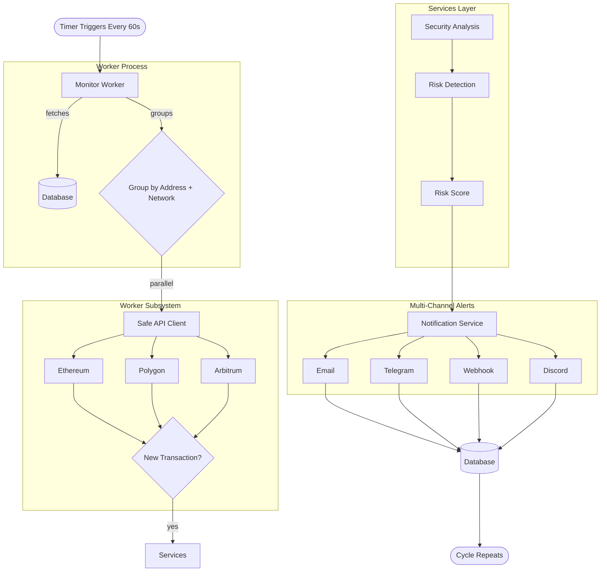

# Worker System Overview

> How the monitoring engine continuously watches your Safe wallets and keeps you informed

## The Power Flow

**Watch** → Monitors continuously poll Safe Transaction Services across multiple chains

**Analyze** → Every transaction is risk-assessed using security heuristics and pattern detection

**Alert** → Instant notifications through your preferred channels when threats are detected

**Remember** → System tracks notification history to avoid alert fatigue
