# Multisigmonitor V1 Heuristics Mapping

## Table of Contents
- [Security Review Items](#security-review-items-attack--vulnerability-detection)
  - [Untrusted Delegate Call](#1-untrusted-delegate-call)
  - [Gas Token Attack](#2-gas-token-attack)
  - [Large Value Transfer](#3-large-value-transfer)
  - [Unusual Gas Settings](#4-unusual-gas-settings)
  - [Unverified Contract Interaction](#5-unverified-contract-interaction)
- [Monitoring Items](#monitoring-items-governance--control-changes)
  - [Owner Removal](#1-owner-removal)
  - [Owner Added](#2-owner-added)
  - [Threshold Changed](#3-threshold-changed)
  - [Module Enabled](#4-module-enabled)
  - [Module Disabled](#5-module-disabled)
  - [Guard Changed](#6-guard-changed)
  - [Fallback Handler Changed](#7-fallback-handler-changed)
  - [Implementation Changed](#8-implementation-changed)
  - [Safe Setup Changed](#9-safe-setup-changed)
  - [Execution Failed](#10-execution-failed)
  - [Low Priority Tracking](#11-low-priority-tracking-informational)

## SECURITY REVIEW ITEMS (Attack & Vulnerability Detection)

### 1. Untrusted Delegate Call

Attack flow:

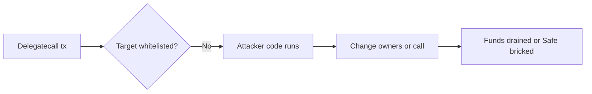

**Request/Response Flow:**  
Safe API `GET /api/v1/safes/{address}/multisig-transactions/` (params: `trusted=true`, `executed=false`, `limit=100`) → returns transaction JSON with `operation`, `to`, `dataDecoded` → local heuristic matches delegatecall + not-in-whitelist → alert

**Severity:** Critical  
**Probability:** High  
**Description:** Detects delegate calls to addresses NOT in the trusted whitelist. `delegatecall` runs target contract code in the Safe’s storage context, so attacker code can move funds, change owners, or brick the Safe. Treat as full compromise unless target is pre-approved.

**Response (key fields):**

```json
{
  "operation": 1,
  "to": "0xMALICIOUS0000000000000000000000000BADCODE",
  "dataDecoded": {
    "method": "approve"
  }
}
```

Heuristic: `(operation == 1) AND (to NOT IN trusted_whitelist)`

Why: Delegate call executes attacker code in Safe context; complete fund/state compromise.

**Trusted whitelist:** MultiSendCallOnly, SafeMigration, SignMessageLib (specific versions)

---

### 2. Gas Token Attack

Attack flow:

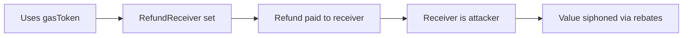

**Request/Response Flow:**  
Safe API `GET /api/v1/safes/{address}/multisig-transactions/` (params: `executed=false`, `limit=100`) → returns transaction JSON with `gasToken`, `refundReceiver`, `gasPrice` → local heuristic detects non-zero combo → alert

**Severity:** High  
**Probability:** Medium  
**Description:** Detects simultaneous use of a non-zero gas token and non-zero refund receiver. This pattern enables gas refund arbitrage where the attacker routes rebates to themselves while masking value exfiltration. Uncommon in legitimate flows.

**Response (key fields):**

```json
{
  "gasToken": "0x6B175474E89094C44Da98b954EedeAC495271d0F",
  "refundReceiver": "0xREFUND123456789012345678901234567890RECV",
  "gasPrice": "25000000000"
}
```

Heuristic: `(gasToken != ZERO_ADDRESS) AND (refundReceiver != ZERO_ADDRESS) AND (gasPrice > 0)` — Why: Attacker siphons funds via gas refund to receiver; profit hidden in gas mechanics.

---

### 3. Large Value Transfer

Attack flow:

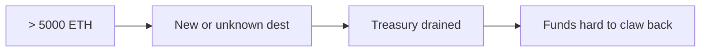

**Request/Response Flow:**  
Safe API `GET /api/v1/safes/{address}/multisig-transactions/` (params: `executed=false`, `limit=100`) → returns transaction JSON with `value` → local heuristic compares to 5000 ETH → alert

**Severity:** High  
**Probability:** Medium  
**Description:** Detects outbound transfers over 5000 ETH. High-value, single-hop treasury movements are rare and warrant immediate verification of destination and authorization.

**Response (key fields):**

```json
{
  "value": "7500000000000000000000",
  "to": "0xRecipientAddress123456789012345678901234"
}
```

Heuristic: `value_wei > 5000 * 1e18` — Why: Large single transfer indicates massive treasury drain; likely unauthorized fund exfiltration.

---

### 4. Unusual Gas Settings

Attack flow:

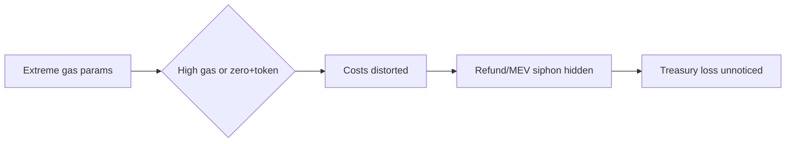

**Request/Response Flow:**  
Safe API `GET /api/v1/safes/{address}/multisig-transactions/` (params: `executed=false`, `limit=100`) → returns transaction JSON with gas fields → local heuristic applies thresholds/combination check → alert

**Severity:** Medium  
**Probability:** Low  
**Description:** Detects extreme gas parameters (safeTxGas/baseGas > 1M) or zero gas price combined with gas token usage. These settings distort cost visibility and can mask siphoning via token refunds or mispriced execution.

**Response (key fields):**

```json
{
  "safeTxGas": "1500000",
  "baseGas": "500000",
  "gasPrice": "0",
  "gasToken": "0x6B175474E89094C44Da98b954EedeAC495271d0F"
}
```

Heuristic: `(safeTxGas > 1_000_000) OR (baseGas > 1_000_000) OR ((gasPrice == 0) AND (gasToken != ZERO_ADDRESS))` — Why: Abnormal gas settings obscure costs; enables hidden value siphon via token refund.

---

### 5. Unverified Contract Interaction

Attack flow:

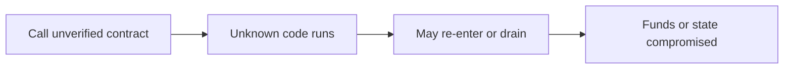

**Request/Response Flow:**  
Safe API `GET /api/v1/safes/{address}/multisig-transactions/` (params: `executed=false`, `limit=100`) → returns transaction JSON with `trusted`, `data`, `to` → local heuristic flags untrusted interaction; optional separate Chainalysis `GET https://public.chainalysis.com/api/v1/address/{addr}` (not automatic in backgroundWorker) for sanctions check

**Severity:** Medium  
**Probability:** Medium  
**Description:** Detects interactions with unverified/untrusted contracts (no published source or trust signal). Calling unknown code expands attack surface; responses may execute arbitrary logic or drain tokens.

**Response (key fields):**

```json
{
  "to": "0xUnknownContractAddress123456789012345",
  "data": "0xa9059cbb...",
  "trusted": false,
  "dataDecoded": {
    "method": "transfer"
  }
}
```

Heuristic: `(trusted == false) AND (data != "0x")` — Why: Unverified contract interaction enables arbitrary code execution; token theft/draining.

---

## MONITORING ITEMS (Governance & Control Changes)

### 1. Owner Removal

Attack flow:

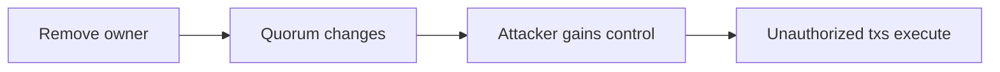

**Request/Response Flow:**  
Safe API `GET /api/v1/safes/{address}/multisig-transactions/` (params: `executed=false`, `limit=100`) → returns transaction JSON with `dataDecoded.method` → local heuristic matches `removeOwner` → alert

**Severity:** Critical  
**Probability:** Medium  
**Description:** Detects when a signer/owner is removed from the Safe. Owners supply the required signatures for any execution, so removal rewrites the quorum. Treat as a high-impact governance change.

**Response (key fields):**

```json
{
  "dataDecoded": {
    "method": "removeOwner"
  }
}
```

Heuristic: `dataDecoded.method == "removeOwner"`

Why: Direct compromise of signing authority; enables unauthorized fund/asset transfers.

---

### 2. Owner Added

Attack flow:

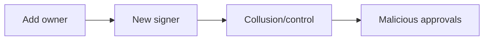

**Request/Response Flow:**  
Safe API `GET /api/v1/safes/{address}/multisig-transactions/` (params: `executed=false`, `limit=100`) → returns transaction JSON with `dataDecoded.method` → local heuristic matches `addOwner` → alert

**Severity:** Critical  
**Probability:** Medium  
**Description:** Detects when a new signer/owner is added. Expands the set of addresses that can approve transactions and influence the threshold. Critical governance change that can insert malicious control.

**Response (key fields):**

```json
{
  "dataDecoded": {
    "method": "addOwner"
  }
}
```

Heuristic: `dataDecoded.method == "addOwner"`

Why: Attacker-controlled signer inserted; enables malicious consensus for theft/rug.

---

### 3. Threshold Changed

Attack flow:

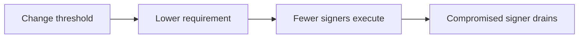

**Request/Response Flow:**  
Safe API `GET /api/v1/safes/{address}/multisig-transactions/` (params: `executed=false`, `limit=100`) → returns transaction JSON with `dataDecoded` parameters → local heuristic matches `changeThreshold` and reads `_threshold` → alert

**Severity:** Critical  
**Probability:** High  
**Description:** Detects when the multisig signature threshold is changed (e.g., 2-of-3 to 1-of-3). Rewrites how many owners must co-sign for any action. Directly impacts blast radius of a compromised signer.

**Response (key fields):**

```json
{
  "dataDecoded": {
    "method": "changeThreshold",
    "parameters": [
      {
        "name": "_threshold",
        "value": "1"
      }
    ]
  }
}
```

Heuristic: `dataDecoded.method == "changeThreshold"`

Why: Reduces quorum; 1/N threshold enables single-signer theft of all funds.

---

### 4. Module Enabled

Attack flow:

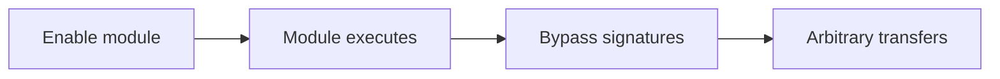

**Request/Response Flow:**  
Safe API `GET /api/v1/safes/{address}/multisig-transactions/` (params: `executed=false`, `limit=100`) → returns transaction JSON with `dataDecoded` parameters → local heuristic matches `enableModule` and reads module address → alert

**Severity:** High  
**Probability:** Medium  
**Description:** Detects when a Safe module (extension contract that can trigger Safe actions without normal signature collection) is enabled. Modules often have broad execution rights and can bypass owner approval flows. Enabling a rogue module effectively delegates control away from owners.

**Response (key fields):**

```json
{
  "dataDecoded": {
    "method": "enableModule",
    "parameters": [
      {
        "name": "module",
        "value": "0xmodule1234567890123456789012345678901234"
      }
    ]
  }
}
```

Heuristic: `dataDecoded.method == "enableModule"`

Why: Modules bypass signature requirements; arbitrary token/fund transfers without owner consent.

---

### 5. Module Disabled

Attack flow:

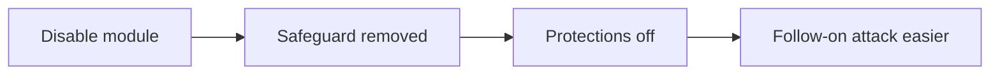

**Request/Response Flow:**  
Safe API `GET /api/v1/safes/{address}/multisig-transactions/` (params: `executed=false`, `limit=100`) → returns transaction JSON with `dataDecoded.method` → local heuristic matches `disableModule` → alert

**Severity:** High  
**Probability:** Low  
**Description:** Detects when a previously enabled module is removed. Modules may enforce automation or security policies, so disabling can strip safeguards. Also useful to spot adversarial cleanup after enabling a malicious module.

**Response (key fields):**

```json
{
  "dataDecoded": {
    "method": "disableModule"
  }
}
```

Heuristic: `dataDecoded.method == "disableModule"`

Why: Disables security/recovery automation; may enable subsequent exploit or lockout.

---

### 6. Guard Changed

Attack flow:

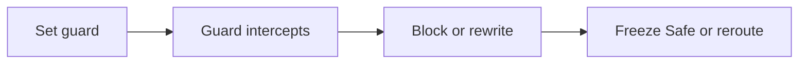

**Request/Response Flow:**  
Safe API `GET /api/v1/safes/{address}/multisig-transactions/` (params: `executed=false`, `limit=100`) → returns transaction JSON with `dataDecoded.method` → local heuristic matches `setGuard` → alert

**Severity:** Critical  
**Probability:** High  
**Description:** Detects when the Safe guard (pre/post execution hook contract) is changed. Guards validate or veto every transaction before execution. A malicious guard can block owners, censor actions, or inject alternate call data.

**Response (key fields):**

```json
{
  "dataDecoded": {
    "method": "setGuard"
  }
}
```

Heuristic: `dataDecoded.method == "setGuard"`

Why: Guards intercept all transactions; malicious guard freezes Safe or redirects calls.

---

### 7. Fallback Handler Changed

Attack flow:

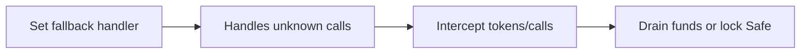

**Request/Response Flow:**  
Safe API `GET /api/v1/safes/{address}/multisig-transactions/` (params: `executed=false`, `limit=100`) → returns transaction JSON with `dataDecoded.method` → local heuristic matches fallback handler methods → alert

**Severity:** Critical  
**Probability:** High  
**Description:** Detects when the fallback handler (contract that processes unknown function selectors, token callbacks, and ERC standards) is changed. A hostile handler can intercept calls, drain tokens, or lock the Safe by hijacking unhandled entry points.

**Response (key fields):**

```json
{
  "dataDecoded": {
    "method": "setFallbackHandler"
  }
}
```

Heuristic: `dataDecoded.method == "setFallbackHandler"`

Why: Fallback intercepts unhandled calls; attacker handler can drain or lock funds.

---

### 8. Implementation Changed

Attack flow:

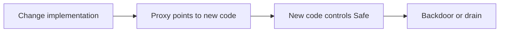

**Request/Response Flow:**  
Safe API `GET /api/v1/safes/{address}/multisig-transactions/` (params: `executed=false`, `limit=100`) → returns transaction JSON with `dataDecoded.method` → local heuristic matches implementation change → alert

**Severity:** Critical  
**Probability:** High  
**Description:** Detects when the Safe proxy’s implementation/master copy is swapped. The implementation defines all Safe logic; pointing to attacker code hands full control of funds and state to the new code.

**Response (key fields):**

```json
{
  "dataDecoded": {
    "method": "changeMasterCopy"
  }
}
```

Heuristic: `dataDecoded.method == "changeMasterCopy"`

Why: Implementation swap enables arbitrary code execution; all funds at risk via backdoor.

---

### 9. Safe Setup Changed

Attack flow:

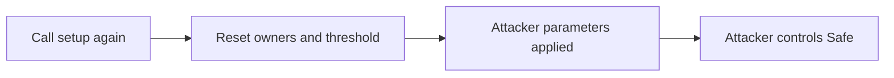

**Request/Response Flow:**  
Safe API `GET /api/v1/safes/{address}/multisig-transactions/` (params: `executed=false`, `limit=100`) → returns transaction JSON with `dataDecoded.method` → local heuristic matches `setup` → alert

**Severity:** Critical  
**Probability:** High  
**Description:** Detects re-calling `setup()` (Safe initializer), which defines owners, threshold, modules, fallback, and guard. A replayed setup can reset control to attacker-owned parameters and redeploy protection surfaces.

**Response (key fields):**

```json
{
  "dataDecoded": {
    "method": "setup"
  }
}
```

Heuristic: `dataDecoded.method == "setup"`

Why: Reinitializes ownership/thresholds; attacker resets Safe to attacker-controlled state.

---

### 10. Execution Failed

Attack flow:

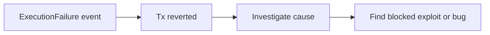

**Request/Response Flow:**  
Safe API `GET /api/v1/safes/{address}/all-transactions/` (params: `executed=true`, `limit=100`) → returns transaction JSON with `dataDecoded.method` → local heuristic matches `ExecutionFailure` → record

**Severity:** Medium  
**Probability:** Low  
**Description:** Detects emitted `ExecutionFailure` events when a transaction reverted. Useful for forensic trails, root-cause analysis, and spotting blocked exploit attempts.

**Response (key fields):**

```json
{
  "dataDecoded": {
    "method": "ExecutionFailure"
  }
}
```

Heuristic: `dataDecoded.method == "ExecutionFailure"`

Why: Failed transaction may indicate attempted exploit; audit for attack vectors.

---

### 11. Low Priority Tracking (Informational)

Attack flow:

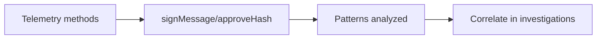

**Request/Response Flow:**  
Safe API `GET /api/v1/safes/{address}/all-transactions/` (params: `limit=100`) → returns transaction JSON with `dataDecoded.method` → local heuristic matches telemetry methods → record

**Severity:** Low  
**Probability:** Very Low  
**Description:** Low-priority capture of execution-related methods (`signMessage`, `approveHash`, etc.). Provides telemetry for pattern analysis and correlated attack sequencing. Not an alert by itself; used for investigations.

Heuristic: `dataDecoded.method IN {signMessage, SignMsg, approveHash, ApproveHash, execTransaction, ExecutionSuccess}`

Why: Audit trail for execution pattern analysis; detect coordinated attack sequences.

**Response (key fields) example:**

```json
{
  "dataDecoded": {
    "method": "signMessage"
  }
}
```
